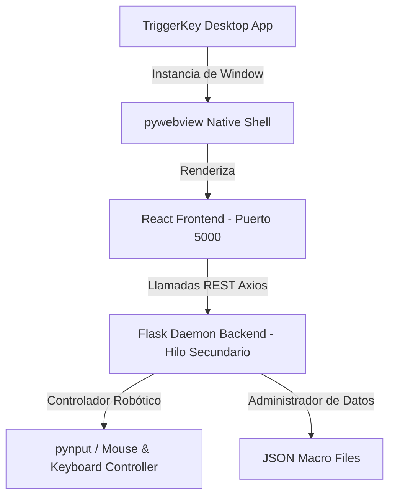

# ⚡ TriggerKey Studio — Operator Console

Language / Idioma: [English (EN)](README.md) | **Español**

[](#)
[](#)
[](#)
[](#)

**TriggerKey Studio** es un entorno de automatización física para Windows. Combina un backend en **Python (Flask + PyAutoGUI + pynput)** con un frontend en **React + Vite + Tailwind CSS**.

Esta suite te permite modelar secuenciadores interactivos de teclado y ratón, configurar disparadores condicionales en segundo plano, programar bucles lógicos infinitos, grabar atajos en tiempo real y desplegar flujos de trabajo con total seguridad mediante atajos globales de detención de emergencia.

---

## 🛠️ Arquitectura y Funcionamiento

El proyecto está diseñado bajo una arquitectura híbrida de escritorio y servidor local:



1. **Backend (Python)**: Levanta un servidor Flask local en segundo plano que se ejecuta de manera segura en un hilo paralelo (*Daemon Thread*). Gestiona el sistema de archivos JSON de las macros, escucha combinaciones físicas mediante hooks globales y reproduce eventos robóticos exactos.
2. **Frontend (React + Vite)**: Compilado en assets estáticos integrados directamente en las rutas de Flask.
3. **Desktop Shell (`pywebview`)**: Envuelve la interfaz web en una ventana nativa de Windows con las herramientas de desarrollador desactivadas en producción para brindar una experiencia de aplicación monolítica, ligera y segura.

---

## ✨ Funcionalidades Destacadas

* 🎯 **Captura de Ratón Inteligente**: Permite parametrizar coordenadas `X` e `Y` exactas de la pantalla física dándole al usuario un temporizador de 3 segundos para mover su cursor antes de registrar la posición real.
* ⌨️ **Mecanografía de Textos Fluidos**: El nodo *Escribir Texto* emula de forma fluida la inserción física de strings en campos de entrada activos, ideal para saludos, correos y formularios automáticos.
* 🎛️ **Línea de Tiempo Conectada**: Visualización interactiva mediante nodos de flujo (`flow-node`) agrupados por colores específicos (Disparador, Ratón, Teclado, Bucles y Lógica), permitiendo reordenar pasos mediante drag-and-drop o añadir acciones rápidas intermedias.
* 🔄 **Bucle Infinito y Control Lógico**: Admite estructuras de repetición limitadas o infinitas (estableciendo iteraciones en `0`). En caso de pérdida de control, el sistema cuenta con un **Atajo de Emergencia Global** (`CTRL + ALT + S` o `ESC`) que libera instantáneamente el sistema.
* 🛑 **Menú Contextual de Pasos**: Clic derecho sobre cualquier paso para duplicarlo, eliminarlo, alterar el orden secuencial, o desactivarlo temporalmente (el paso se vuelve translúcido y el motor de ejecución lo omite de manera inteligente).
* 📁 **Librería y Plantillas**: Cargador de secuencias preconfiguradas y buscador inteligente de macros locales con teclas rápidas asignadas.

---

## 📦 Dependencias y Requisitos

### Backend (Python 3.10+)
Los requisitos de Python están detallados en el archivo `requirements.txt`:
* **`Flask`**: Para servir la API REST y las vistas de producción de la UI.
* **`Flask-Cors`**: Habilitación de CORS para el entorno de desarrollo y pruebas locales de Vite.
* **`pynput`**: Para interceptar teclas físicas de forma global, registrar atajos en caliente y emular los movimientos del ratón/teclado.
* **`pywebview`**: Contenedor nativo de escritorio para Windows.
* **`pyinstaller`**: Empaquetador de la aplicación completa en un único archivo ejecutable portátil `.exe`.

### Frontend (Node.js 18+)
Instalado en el subdirectorio `frontend`:
* **`React` & `Vite`**: Compilador de alto rendimiento para la aplicación de una sola página (SPA).
* **`Tailwind CSS`**: Procesador de estilos utilitarios configurado con los canales HSL del tema para opacidades nativas óptimas.
* **`Axios`**: Cliente HTTP de promesas asíncronas para el consumo de la API REST local.

---

## 🚀 Guía de Scripts y Despliegue

### 1. Preparar el Entorno (Automático)
El proyecto está equipado con un script de configuración inteligente (`setup.py`) que comprueba tanto las dependencias de Python como las de Node.js. El mismo detecta qué dependencias ya están instaladas para evitar reinstalaciones innecesarias o pasos redundantes:

```bash
python setup.py
```
*Este comando valida e instala automáticamente los paquetes de Python, verifica Node.js/NPM y prepara los paquetes de React del frontend sin duplicar instalaciones. También ofrece compilar el `.exe` al finalizar.*

---

### 2. Compilador del Frontend (`build_front.py`)
Para transpilar todo el código React y Tailwind a assets estáticos nativos y desplegarlos dentro de las carpetas estáticas de Flask en el backend, ejecuta:
```bash
python build_front.py
```
*Este script de automatización ejecuta `npm run build` en el frontend, limpia los directorios de producción de Flask (`backend/templates` y `backend/static/assets`) y trasplanta los bundles de forma limpia.*

---

### 3. Ejecutar la Aplicación en Desarrollo
Puedes ejecutar el servidor Flask local con la ventana nativa activada de forma directa:
```bash
./run_debug.bat
```
*Con este comando se ejecuta la app en modo debug y se habilita el modo de herramientas para el contenedor pywebview.*

Opcionalmente puedes ejecutar el backend en modo debug manualmente con el siguiente comando:
```bash
set TRIGGERKEY_DEBUG=1
python main.py
```
*Si estás trabajando activamente en la interfaz web, puedes levantar la suite de desarrollo en tiempo real de Vite ejecutando `npm run dev` dentro del directorio `frontend/`.*

---

### 4. Compilar a Ejecutable Portátil (`build_exe.py`)
Para empaquetar todo el proyecto (el backend de Python, el servidor Flask, el contenedor pywebview y los assets compilados de React) en un único archivo portátil ejecutable independiente `.exe` de Windows:
```bash
python build_exe.py
```
*El ejecutable generado se empaqueta de forma independiente recopilando todas las librerías dinámicas y los binarios necesarios, permitiendo ejecutar TriggerKey en cualquier sistema Windows sin necesidad de tener Python o Node instalados.*

*Adicionalmente, la app ya compilada como ejecutable portátil ya se encuentra en la raíz del proyecto, llamada `TriggerKey.exe`, siendo la más reciente versión hasta el momento del proyecto.*

---

## 🌐 Endpoints de la API REST local

El backend de Flask expone una API REST técnica en `http://127.0.0.1:5000` consumida por el frontend mediante `api.js`:

| Endpoint | Método | Descripción |
| :--- | :--- | :--- |
| `/api/status` | `GET` | Retorna si el motor está reproduciendo (`playing`) o grabando (`recording`). |
| `/api/macros` | `GET` | Retorna un listado de todos los archivos de macro guardados localmente. |
| `/api/macros` | `POST` | Guarda o sobrescribe una macro local enviándole el nombre, pasos y el atajo. |
| `/api/macros/<name>` | `DELETE` | Elimina de forma permanente una macro del disco local. |
| `/api/record/start` | `POST` | Inicia la escucha y grabación global de eventos físicos en tiempo real. |
| `/api/record/stop` | `POST` | Detiene la grabación actual y retorna los pasos recopilados estructurados. |
| `/api/play/<name>` | `POST` | Carga e inicia la ejecución automática de la secuencia de una macro guardada. |
| `/api/play/steps` | `POST` | Ejecuta de forma directa una secuencia temporal de pasos enviados por JSON. |
| `/api/stop` | `POST` | Detención de emergencia (para de inmediato reproducciones y grabaciones). |
| `/api/mouse/position` | `GET` | Consulta y retorna la posición actual real en coordenadas cartesianas del ratón. |

---

## 🔒 Atajos de Seguridad Globales

* **`CTRL + ALT + S`** (o **`ESC`**): Detención Inmediata. Detiene todas las operaciones en segundo plano, cancela bucles infinitos y libera cualquier bloqueo físico del sistema de forma segura.
