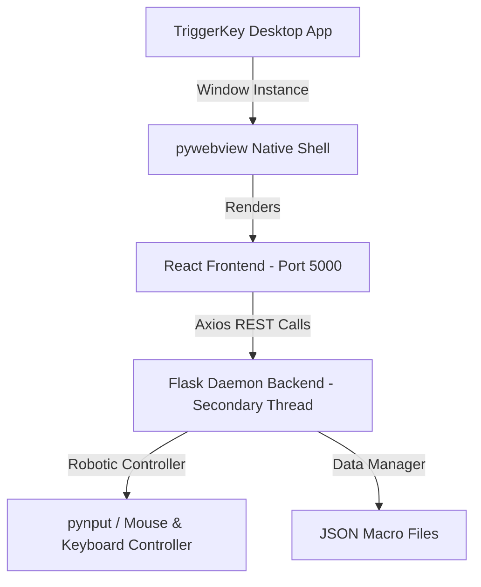

# ⚡ TriggerKey Studio — Operator Console

Language / Idioma: **English** | [Español (ES)](README.es.md)

[](#)
[](#)
[](#)
[](#)

**TriggerKey Studio** is a physical automation environment for Windows. It combines a **Python (Flask + PyAutoGUI + pynput)** backend with a **React + Vite + Tailwind CSS** frontend.

This suite allows you to model interactive keyboard and mouse sequencers, configure background conditional triggers, program infinite logic loops, record shortcuts in real-time, and deploy workflows with complete safety using global emergency stop hotkeys.

---

## 🛠️ Architecture and Operation

The project is designed with a hybrid desktop and local server architecture:



1. **Backend (Python)**: Runs a local Flask server in the background safely on a parallel thread (*Daemon Thread*). It manages the JSON file system for macros, listens to physical combinations via global hooks, and replays exact robotic events.
2. **Frontend (React + Vite)**: Compiled into static assets integrated directly into Flask routes.
3. **Desktop Shell (`pywebview`)**: Wraps the web interface in a native Windows window with developer tools disabled in production for a monolithic, lightweight, and secure application experience.

---

## ✨ Key Features

* 🎯 **Smart Mouse Capture**: Allows parameterizing exact `X` and `Y` coordinates on the physical screen, giving the user a 3-second timer to move their cursor before registering the actual position.
* ⌨️ **Fluid Text Typing**: The *Write Text* node seamlessly emulates physical string insertion into active input fields, ideal for automated greetings, emails, and forms.
* 🎛️ **Connected Timeline**: Interactive visualization via flow nodes (`flow-node`) grouped by specific colors (Trigger, Mouse, Keyboard, Loops, and Logic), allowing steps to be reordered via drag-and-drop or quick intermediate actions to be added.
* 🔄 **Infinite Loop & Logical Control**: Supports limited or infinite repetition structures (setting iterations to `0`). In case of loss of control, the system features a **Global Emergency Hotkey** (`CTRL + ALT + S` or `ESC`) that instantly releases system control.
* 🛑 **Step Contextual Menu**: Right-click on any step to duplicate it, delete it, alter the sequential order, or temporarily disable it (the step becomes translucent and the execution engine intelligently skips it).
* 📁 **Library & Templates**: Preconfigured sequence loader and smart local macro search engine with assigned hotkeys.

---

## 📦 Dependencies and Requirements

### Backend (Python 3.10+)
Python requirements are detailed in the `requirements.txt` file:
* **`Flask`**: Serves the REST API and UI production views.
* **`Flask-Cors`**: Enables CORS for local Vite development and testing.
* **`pynput`**: Intercepts physical keys globally, registers hotkeys on the fly, and emulates mouse/keyboard movements.
* **`pywebview`**: Native desktop container for Windows.
* **`pyinstaller`**: Packages the entire application into a single portable `.exe` executable.

### Frontend (Node.js 18+)
Installed in the `frontend` subdirectory:
* **`React` & `Vite`**: High-performance compiler for the Single Page Application (SPA).
* **`Tailwind CSS`**: Utility-first style processor configured with theme HSL channels for optimal native opacities.
* **`Axios`**: Promise-based HTTP client for consuming the local REST API.

---

## 🚀 Script and Deployment Guide

### 1. Environment Setup (Automatic)
The project is equipped with a smart setup script (`setup.py`) that checks both Python and Node.js dependencies. It detects what is already installed to avoid reinstalling or performing redundant steps:

```bash
python setup.py
```
*This command automatically validates and installs Python packages, checks for Node.js/NPM, and prepares the React frontend packages without duplicate installations. It also offers to compile the `.exe` at the end.*

---

### 2. Frontend Compiler (`build_front.py`)
To transpile all React and Tailwind code into native static assets and deploy them inside Flask's static folders in the backend, run:
```bash
python build_front.py
```
*This automation script runs `npm run build` in the frontend, cleans the Flask production directories (`backend/templates` and `backend/static/assets`), and cleanly transfers the bundles.*

---

### 3. Run Application in Development
You can directly run the local Flask server with the native window enabled:
```bash
./run_debug.bat
```
*This command runs the app in debug mode and enables developer tools for the pywebview shell.*

Alternatively, you can manually run the backend in debug mode with the following command:
```bash
set TRIGGERKEY_DEBUG=1
python backend/app.py
```
*If you are actively working on the web interface, you can start Vite's real-time development suite by running `npm run dev` inside the `frontend/` directory.*

---

### 4. Compile to Portable Executable (`build_exe.py`)
To package the entire project (Python backend, Flask server, pywebview container, and compiled React assets) into a single standalone portable `.exe` Windows file:
```bash
python build_exe.py
```
*The generated executable is packaged independently, collecting all necessary dynamic libraries and binaries, allowing TriggerKey to run on any Windows system without requiring Python or Node installed.*

*Additionally, the compiled portable app is already located in the root of the project, named `TriggerKey.exe`, representing the latest compiled version of the project.*

---

## 🌐 Local REST API Endpoints

The Flask backend exposes a technical REST API on `http://127.0.0.1:5000` consumed by the frontend via `api.js`:

| Endpoint | Method | Description |
| :--- | :--- | :--- |
| `/api/status` | `GET` | Returns whether the engine is playing (`playing`) or recording (`recording`). |
| `/api/macros` | `GET` | Returns a list of all locally saved macro files. |
| `/api/macros` | `POST` | Saves or overwrites a local macro sending the name, steps, and trigger key. |
| `/api/macros/<name>` | `DELETE` | Permanently deletes a macro from local disk storage. |
| `/api/record/start` | `POST` | Starts global listening and recording of real-time physical events. |
| `/api/record/stop` | `POST` | Stops current recording and returns structured steps collected. |
| `/api/play/<name>` | `POST` | Loads and starts automatic playback of a saved macro sequence. |
| `/api/play/steps` | `POST` | Directly plays a temporary sequence of steps sent via JSON. |
| `/api/stop` | `POST` | Emergency Stop (stops playback and recording immediately). |
| `/api/mouse/position` | `GET` | Queries and returns the actual real-time mouse position in Cartesian coordinates. |

---

## 🔒 Global Security Hotkeys

* **`CTRL + ALT + S`** (or **`ESC`**): Immediate Stop. Halts all background operations, cancels infinite loops, and safely releases physical input blocks on the system.